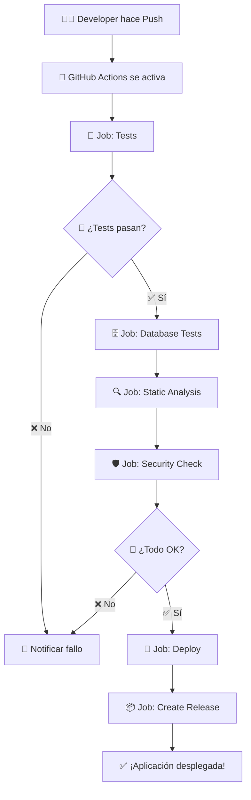

# 🚀 **GUÍA DE CI/CD - GITHUB ACTIONS**

## 🎯 **¿Qué es CI/CD?**

**CI/CD** significa **Continuous Integration / Continuous Deployment** (Integración Continua / Despliegue Continuo).

- **CI (Integración Continua):** Ejecuta tests automáticamente cada vez que haces push al repositorio
- **CD (Despliegue Continuo):** Despliega automáticamente la aplicación cuando los tests pasan

## 📋 **Configuración Actual**

### **Archivos Configurados:**

```
.github/
└── workflows/
    ├── tests.yml     ← Testing automatizado
    └── deploy.yml    ← Despliegue automatizado
```

## 🧪 **Workflow de Testing (`tests.yml`)**

### **Se ejecuta cuando:**
- ✅ Haces `push` a `main` o `develop`
- ✅ Creas un `pull request` hacia `main` o `develop`
- ✅ Manualmente desde la interfaz de GitHub

### **Jobs configurados:**

#### **1. 🔬 Tests Principales**
- **Matriz de PHP:** 8.1, 8.2, 8.3
- **Base de datos:** SQLite en memoria
- **Tests ejecutados:**
  - Tests Unitarios (Caja Blanca)
  - Tests de API (Caja Negra)
  - Tests de Integración
  - Tests de Comportamiento (E2E)
  - Cobertura de código

#### **2. 🗄️ Tests de Base de Datos**
- **Bases de datos:** MySQL 8.0, PostgreSQL 14
- **Propósito:** Verificar compatibilidad con diferentes DB

#### **3. 🔍 Análisis Estático**
- **PHPStan:** Análisis de código estático
- **Verificación de sintaxis PHP**

#### **4. 🛡️ Seguridad**
- **Audit de dependencias:** Busca vulnerabilidades conocidas
- **Verificación de archivos sensibles:** .env, secrets, etc.

## 🚀 **Workflow de Despliegue (`deploy.yml`)**

### **Se ejecuta cuando:**
- ✅ Los tests pasan exitosamente
- ✅ Hay push a la rama `main`

### **Jobs configurados:**

#### **1. 🚀 Despliegue**
- Instala dependencias de producción
- Construye assets (si tienes npm/Vite)
- Despliega via SSH o Heroku (configurable)

#### **2. 📦 Release Automático**
- Crea tags automáticos
- Genera changelog desde commits
- Publica release en GitHub

## 🛠️ **Cómo Configurar en tu Repositorio GitHub**

### **Paso 1: Subir archivos al repositorio**

```bash
# Desde tu terminal local
cd C:\Users\jramirez\Desktop\alumnos-app

# Añadir archivos de workflow
git add .github/
git commit -m "🚀 Agregar CI/CD con GitHub Actions"
git push origin main
```

### **Paso 2: Configurar Secrets (si vas a desplegar)**

En GitHub, ve a: **Settings** → **Secrets and variables** → **Actions**

Agrega estos secrets si planeas desplegar:

```
# Para despliegue SSH
HOST=tu-servidor.com
USERNAME=tu-usuario
SSH_PRIVATE_KEY=tu-clave-ssh-privada
PORT=22

# Para Heroku
HEROKU_API_KEY=tu-api-key-de-heroku

# Para notificaciones (opcional)
SLACK_WEBHOOK=tu-webhook-de-slack
DISCORD_WEBHOOK=tu-webhook-de-discord
```

### **Paso 3: Configurar Environment (para producción)**

1. Ve a **Settings** → **Environments**
2. Crea environment llamado `production`
3. Configura protection rules:
   - ✅ Required reviewers
   - ✅ Wait timer
   - ✅ Deployment branches (solo `main`)

## 📊 **Monitoring y Badges**

### **Badges para README principal:**

Agrega estos badges al README.md principal:

```markdown


```

### **Ver resultados de los tests:**

1. Ve a tu repositorio en GitHub
2. Click en la pestaña **Actions**
3. Verás todos los workflows ejecutándose

## 🔍 **Ejemplo de Flujo Completo**



## 🎯 **Configuraciones Específicas por Ambiente**

### **Development (.github/workflows/tests.yml)**
```yaml
# Ejecutar en cada push y PR
on:
  push:
    branches: [ main, develop ]
  pull_request:
    branches: [ main, develop ]
```

### **Staging (opcional)**
```yaml
# Solo cuando se hace push a develop
on:
  push:
    branches: [ develop ]
```

### **Production (.github/workflows/deploy.yml)**
```yaml
# Solo cuando los tests pasan en main
on:
  workflow_run:
    workflows: ["🧪 Laravel Testing Suite"]
    types: [completed]
    branches: [ main ]
```

## 🚨 **Troubleshooting Común**

### **❌ Tests fallan en GitHub pero pasan localmente:**

```yaml
# Verificar variables de entorno
env:
  DB_CONNECTION: sqlite
  DB_DATABASE: ":memory:"
  APP_ENV: testing
```

### **❌ Error de permisos SSH:**

```bash
# Generar clave SSH correcta
ssh-keygen -t rsa -b 4096 -C "github-actions@tu-proyecto.com"
# Agregar clave pública al servidor
# Agregar clave privada como secret en GitHub
```

### **❌ Fallo en instalación de dependencias:**

```yaml
# Verificar cache de composer
- name: Cache Composer Dependencies
  uses: actions/cache@v3
  with:
    path: ~/.composer/cache/files
    key: dependencies-composer-${{ hashFiles('composer.json') }}
```

## 📈 **Métricas y Reportes**

### **Cobertura de Código:**
- Integración con **Codecov** configurada
- Reportes automáticos en PRs
- Trends de cobertura a lo largo del tiempo

### **Tiempo de Ejecución:**
- Tests unitarios: ~30 segundos
- Tests completos: ~2-3 minutos
- Despliegue: ~1-2 minutos

### **Frecuencia:**
- Tests se ejecutan en cada push
- Despliegue solo en main
- Release automático después de despliegue exitoso

## 🎓 **Para tu Presentación**

### **Puntos clave a destacar:**

1. **Automatización Completa:**
   - Testing automático en múltiples versiones de PHP
   - Múltiples bases de datos
   - Análisis de seguridad automatizado

2. **Calidad Asegurada:**
   - No se despliega si los tests fallan
   - Verificación de código estático
   - Audit de seguridad

3. **Trazabilidad:**
   - Changelog automático
   - Releases versionados
   - Badges de estado

4. **Escalabilidad:**
   - Fácil agregar nuevos ambientes
   - Configuración por matriz (PHP versions)
   - Jobs paralelos para rapidez

## 🔗 **Recursos Adicionales**

- [Documentación de GitHub Actions](https://docs.github.com/en/actions)
- [Laravel GitHub Actions](https://github.com/marketplace/actions/setup-php-action)
- [Codecov para Laravel](https://codecov.io/)
- [Heroku Deploy Action](https://github.com/marketplace/actions/deploy-to-heroku)

---

**¡Tu proyecto ahora tiene CI/CD profesional configurado!** 🚀
